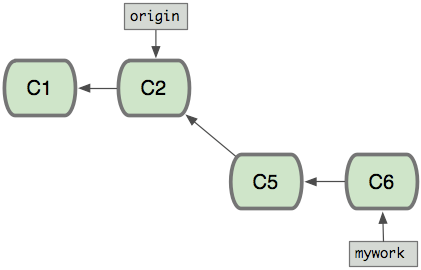
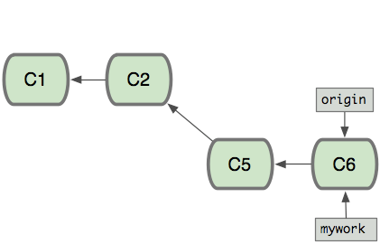

<!SLIDE>
# GIT

<!SLIDE>
# Getting started
Configure some general settings.

    git config --global user.name "Jan Vansteenkiste"
    git config --global user.email "jan@vstone.eu"

    git config --global color.diff auto
    git config --global color.status auto
    git config --global color.branch auto

<!SLIDE lefty>
# Creating a new repository

Initialize:

    mkdir repo
    cd repo
    git init

The first commit

    touch README
    git add README
    git commit -m 'Added initial readme'

<!SLIDE lefty>
# Committing

## Index (Staging area)

The index contains the changes that will be added to your next commit.
Your commit will /not/ contain all the changes in your working directory.
You have to select the changes you want to add yourself manually.

Changes made to a file after it has been added to the index will NOT be
included in the commit. You have to re-add the file.

<!SLIDE>

<!SLIDE>

### Prepare your commit 

    @@@ sh
    git diff
    # Shows the diff of your working copy against head.

    git diff --cached
    # Shows the diff against the index.

    git add <filename>
    # Add a file to the index

    git add -p <filename>
    # Add a part of the file to the index.

(Demo follows.)

<!SLIDE>
## Status

<!SLIDE>

## Commit

    @@@ sh
    git commit -m 'message'
    # Commit the index with this message

    git commit -m 'message' -e
    # Commit the index with this message but open an
    # editor to adjust it.

    git commit -a
    # Commits all the modified files
    # Use this with care when working with submodules.

<!SLIDE>

<!SLIDE lefty>
## Viewing the history

    @@@ sh
    git log -n 10

### Using an alias:
<pre style="white-space: pre-wrap;"><code>[alias]
l = log -n 15 --graph --pretty=format:'%Cred%h%Creset -%C(yellow)%d%Creset %s %Cgreen(%cr) %C(bold blue)&lt;%an&gt;%Creset%n' --abbrev-commit --date=relative
</code></pre>
<!SLIDE lefty>
# Undoing changes

## Checkout
Checkout a single file. Notice the dashes: `git checkout` is also used in other cases, this makes it clear to Git that you are pointing to a single file.

    git checkout -- /path/to/file    # restore version from index
    git checkout HEAD /path/to/file  # restore to latest committed version

<!SLIDE lefty>
## Reset
Reset your branch to a commit and all the changes in your working copy

    git reset [--hard]

## Revert
Write a reversed version of an existing commit. This is very useful if you have already pushed the commit

    git revert [commit-sha]

<!SLIDE lefty>
# References or "refs"
Because a commit hash is very difficult to remember and not really useful to work with, Git uses references to point to specific commits.

* HEAD
  * It points to the commit which is currently checked out into your working directory
* master
  * master is the 'default' branch in Git
  * when working on the master branch, the master reference and the HEAD reference point to the same commit
* Specials
  * **HEAD^** or **HEAD^^**: The commit before HEAD, two commits before HEAD
  * **master~7**: 7 commits before master reference

<!SLIDE lefty>
# Branches

    @@@ sh
    git branch
    # Lists all local branches

    git branch -a
    # Lists all local and remote branches

    git branch [branch]
    # Create a new branch (based on current rev)
    git checkout [branch name]
    # switch to the new branch.

    git checkout -b [branch]
    # Create and switch to a new branch.

<!SLIDE>
# Working with remotes
From the start:

    git clone git@git.tools.be01.uni:users/upjan/private.git

or afterwards:

    git remote add origin git@git.tools.be01.uni:users/upjan/private.git

<!SLIDE>
## Pulling and pushing

    git push origin master

or

    @@@ sh
    git push -u origin master
    # --set-upstream (link local to remote repo for future pulls)

<!SLIDE>
## Using remote branches

    @@@ sh
    git checkout develop
    # returns:
    # error: pathspec 'develop' did not match any file(s) known to git

    git checkout origin/develop
    # We end up in 'detached HEAD'
    git checkout -b develop
    # Create new branch on current rev.

<!SLIDE>
# Tags

    @@@ sh
    git tag NAME
    # creates a name on the current HEAD

    git push --tags
    # sync tags to remote repository

    git fetch --tags
    # get tags from remote repository.

    git tag
    # gives a list of all tags

<!SLIDE lefty>
# Merging

When merging two or more branches there are two possibilities:

* Merge commit
* Fast Forward

<!SLIDE>
## Merge commit
* When both branches have new commits a merge commit is created.
* Git automatically proposes a commit message:  
  `Merge branch 'mywork' into master`

* The commit has two or more parents
* Optionally, you have to resolve conflicts.

<!SLIDE lefty>
## Fast Forward

 
Merge the 'mywork' branch into origin 
 
The origin branch is simply fast-forwarded

<!SLIDE lefty>

# Rebasing
Instead of merging (with merge commits) you can also rebase (so you can then fast forward)

Some people will tell you that this is very harmful, it can break your repository and destroy the universe.
This is **NOT TRUE**. (At least if you know what you are doing)

## What?

Rewrite History

<!SLIDE>
# Rebasing

* Edit a commit message
* Add missing files to a commit
* Reorder your commits
* Modify the parent of a commit
* Merge a few commits together into a single commit
* Delete commits from the history
* ...
* And break your repository if you want :)

<!SLIDE>

# DO NOT REBASE COMMITS THAT HAVE BEEN PUSHED

<!SLIDE lefty>
## Amending changes

* The easiest and 'safest' kind of rebase
* Only possible for the most recent commit
* Let's you add missing files and modify the commit message

After modifying your index again:

    git commit --amend

## Do not amend a commit that has already been pushed!

<!SLIDE>
## Difference with merging

* Replay your changes on another branch.

<!SLIDE lefty>

# Git Stash

Sometimes you will want to reset your working copy to a clean state, without committing your work, nor deleting it. In this case you can stash your changes:

    @@@ sh
    git stash
    # saves everything in a stash
    git stash save "something fancy i was working on"
    # adds a nice message.

This will create something like a commit and hard-reset your working copy.

<!SLIDE lefty>

## Stash: retrieve

Later you can retrieve your work:

    @@@ sh
    git stash list
    # list all your stashes

    git stash pop
    # re-apply the latest stash.
    # This will also delete the stash if it applies

    git stash apply
     # like pop, but do not delete the stash

<!SLIDE lefty>
## Stash: Usecase
I often use the stash when I want to `git pull --rebase`, while I have uncommitted changes (git will refuse to do it in that case):

    @@@ sh
    git stash
    git pull --rebase
    git stash pop
